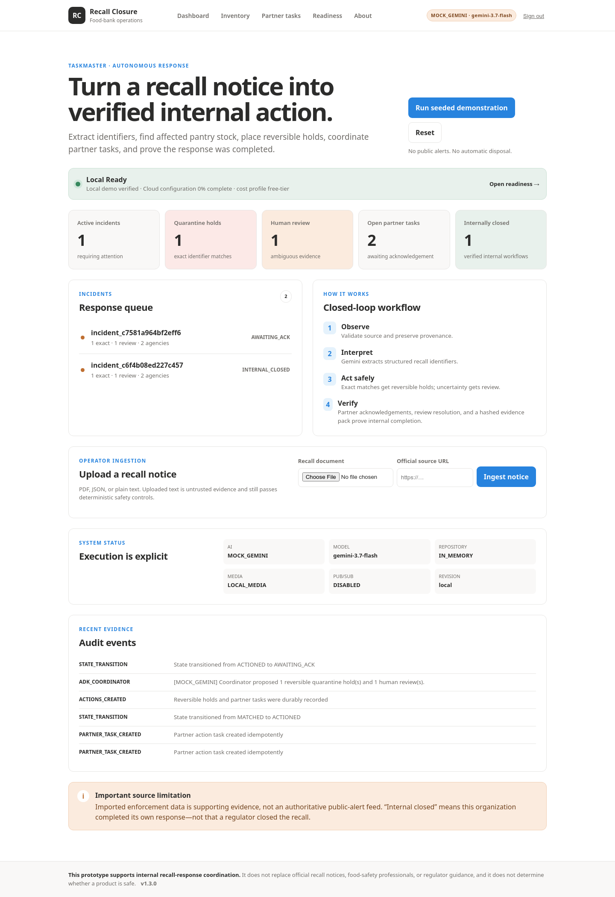
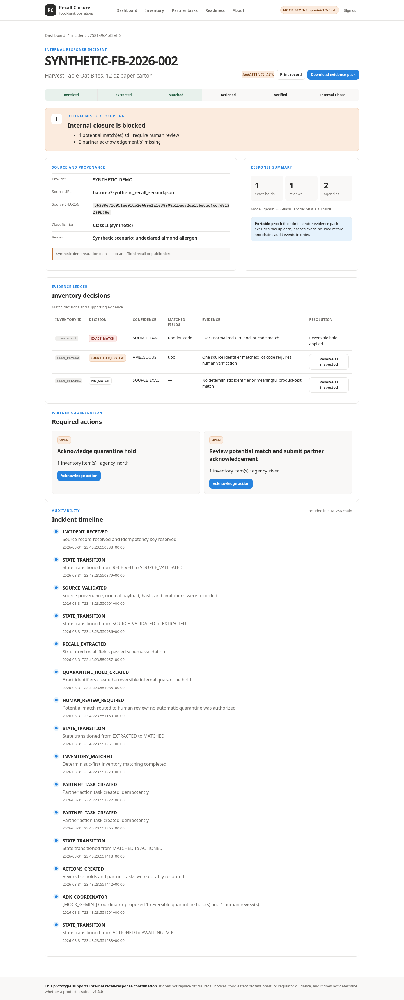

# Food-Bank Recall Closure Agent

**Food-Bank Recall Closure Operations v1.3.0** is a Taskmaster-track application that converts a food-recall source record into a verified **internal operational closure** across a food bank and fictional partner pantries.

Recall discovery is not recall completion. This project finds affected donated inventory across inconsistent records, creates reversible quarantine holds and human-review work, gathers partner acknowledgement, suppresses duplicate events, and proves what happened in an audit timeline.

> **Safety boundary:** This prototype supports internal recall-response coordination. It does not replace official recall notices, food-safety professionals, or regulator guidance, and it does not determine whether a product is safe.



## Working capabilities

- Operator upload of PDF, JSON, or plain-text notices with private evidence storage.
- Optional operator-initiated, fixed-domain openFDA record import with a visible limitation.
- Pydantic-validated Gemini structured extraction and package-image observation in `LIVE` mode.
- A real Google ADK 2.x `RecallCoordinatorAgent` with eight typed, proposal/read-only tools.
- Deterministic matching before AI: only normalized UPC **and** lot/batch equality creates `EXACT_MATCH`.
- Reversible `QUARANTINED` hold for an exact match; partial/semantic/visual results become a potential match requiring human review.
- Idempotent incident, match, and partner-task identifiers for Pub/Sub redelivery.
- Partner acknowledgement, optional evidence upload, review resolution, and closure blockers.
- Firestore and Cloud Storage production adapters; in-memory/local adapters for deterministic development.
- FastAPI/Jinja operations UI, structured logs, authenticated mutations, CSRF protection, and security headers.
- Cloud Run, Secret Manager, Pub/Sub push, dead-letter, CI, rollback, and cleanup assets.
- Administrator-only tamper-evident evidence packs with per-file SHA-256 and an ordered audit hash chain.
- A redacted readiness control plane, safe local `.env` generator, Google Cloud identifier collector, and free-tier cost profile.



## Genuine agentic loop

1. The application validates and stores a source record and provenance.
2. Gemini converts untrusted source text/PDF into a strict schema and can observe ambiguous package evidence.
3. The deterministic workflow classifies inventory, creates holds/reviews/tasks, and owns legal state transitions.
4. `RecallCoordinatorAgent` receives sanitized incident context and may call only eight allowlisted read/proposal tools.
5. Humans resolve potential matches and submit partner acknowledgement.
6. Deterministic verification closes the **internal** workflow only when all blockers are empty.

The model cannot write arbitrary status, authorize disposal, publish a safety alert, or claim regulator closure.

## Technology

| Layer | Selection |
|---|---|
| Runtime | Python 3.12 production target |
| Web | FastAPI 0.139.2, Uvicorn 0.51.0, Jinja2 |
| Agent | Google ADK 2.7.1 (`from google.adk import Agent`) |
| Model SDK | Google Gen AI SDK 2.20.0 |
| Configured model | `gemini-3.7-flash` |
| State | Firestore or `InMemoryRepository` |
| Events | Authenticated Pub/Sub push with retry/DLQ |
| Evidence | Private Cloud Storage or local media |
| Deployment | One Cloud Run service |

Versions are pinned in `requirements.txt`. Compatibility-critical transitive packages are pinned in `constraints-python312.txt`, derived from Google ADK 2.7.1's official Python 3.12 constraints. The release ZIP was built in an offline sandbox, so ADK/Gemini imports and live calls are explicitly reported as blocked—not passed—in `BUILD_REPORT.md`.

## Run locally

### Windows Command Prompt

Prerequisites: CPython 3.12 and dependency-download access. Do not use the POSIX `source` command on Windows. The setup script invokes the virtual environment's interpreter directly, so activation is unnecessary.

```bat
scripts\setup_windows.cmd
scripts\run_windows.cmd
```

Equivalent manual commands:

```bat
py -3.12 -m venv --clear .venv
.venv\Scripts\python.exe -m pip install --upgrade pip
.venv\Scripts\python.exe -m pip install -r requirements-dev.txt
.venv\Scripts\python.exe -m pip check
.venv\Scripts\python.exe scripts\adk_import_smoke.py
.venv\Scripts\python.exe -m unittest discover -s tests -v
.venv\Scripts\python.exe scripts\http_smoke.py
set AI_MODE=mock
.venv\Scripts\python.exe -m uvicorn app.main:app --host 127.0.0.1 --port 8080
```

If the Windows Python launcher is unavailable, replace `py -3.12` with `%LocalAppData%\Programs\Python\Python312\python.exe`.

### macOS/Linux

```bash
python3.12 -m venv .venv
source .venv/bin/activate
python -m pip install --upgrade pip
python -m pip install -r requirements-dev.txt
cp .env.example .env
AI_MODE=mock python -m uvicorn app.main:app --reload --port 8080
```

Open `http://localhost:8080`. Development default administrator token: `demo-admin`. Replace it before any shared deployment.

### Offline core and preview

The checked-in golden path runs without FastAPI, ADK, or cloud credentials when Pydantic is available:

```bash
python scripts/seed_demo.py
python scripts/run_golden_path.py
python -m unittest discover -s tests -v
python scripts/offline_preview_server.py
```

The offline preview server is only a visual/health fallback. Production remains the FastAPI application.

## New in v1.2.0

- `/readiness` and `/api/readiness` show local/cloud prerequisites without secret values.
- Incident pages export a privacy-minimized evidence-pack ZIP after administrator authentication.
- `scripts/configure_local_env.py` generates local secrets and optionally accepts a Gemini key through hidden input.
- `scripts/gcp_collect_config.py` gathers non-secret project, service, bucket, Pub/Sub, and readiness identifiers.
- The real HTTP smoke test now checks stable semantic identity instead of brittle marketing copy.

Read `docs/GOOGLE_CLOUD_FREE_SETUP.md` before enabling billing or deploying.

## AI modes

| `AI_MODE` | Behavior | Visible label |
|---|---|---|
| `mock` | Deterministic fixture extraction; no model request | `MOCK_GEMINI` |
| `replay` | Replays sanitized stored output; no live request | `REPLAY` |
| `live` | Calls configured Gemini model and invokes ADK coordinator | `LIVE_GEMINI` |

Run an explicitly authorized live smoke test only when credentials exist:

```bash
RUN_LIVE_GEMINI_TESTS=1 AI_MODE=live GEMINI_API_KEY='...' python scripts/live_gemini_smoke.py
python scripts/adk_import_smoke.py
```

## Seeded demonstration

```bash
python scripts/run_golden_path.py
```

The command proves:

1. two fictional agencies and three fictional products are seeded;
2. the exact UPC+lot item receives a reversible quarantine hold;
3. the same-UPC/missing-lot item becomes a potential match requiring human review;
4. the unrelated control stays available;
5. partner tasks are created idempotently;
6. review resolution and acknowledgements are required for `INTERNAL_CLOSED`;
7. replaying the source record creates no duplicate tasks or holds.

All fixture products, organizations, names, and package images are synthetic.

## Configuration

| Variable | Purpose | Development default |
|---|---|---|
| `APP_ENV` | `development` or `production` validation | `development` |
| `PORT` | HTTP port | `8080` |
| `APP_BASE_URL` | Canonical service URL | `http://localhost:8080` |
| `SESSION_SECRET` | Signed session secret | insecure local value; replace |
| `DEMO_ADMIN_TOKEN` | Mutation login token | `demo-admin`; replace |
| `AI_MODE` | `mock`, `replay`, or `live` | `mock` |
| `MODEL_NAME` | Gemini model | `gemini-3.7-flash` |
| `MODEL_MAX_ATTEMPTS` | Bounded model attempts, 1–5 | `3` |
| `GEMINI_API_KEY` | Live Gemini secret | unset |
| `GOOGLE_CLOUD_PROJECT` | GCP project | unset |
| `GOOGLE_CLOUD_REGION` | Cloud Run/storage region | `us-central1` |
| `FIRESTORE_DATABASE` | Firestore database | `(default)` |
| `USE_FIRESTORE` | Select durable repository | `false` |
| `GCS_BUCKET` | Private evidence bucket | unset |
| `USE_CLOUD_STORAGE` | Select cloud media adapter | `false` |
| `PUBSUB_VERIFICATION_AUDIENCE` | OIDC audience | unset |
| `MAX_DOCUMENT_BYTES` | Recall upload limit | 10 MiB |
| `MAX_IMAGE_BYTES` | Image upload limit | 8 MiB |
| `CLOUD_COST_PROFILE` | Free-tier or standard deployment posture | `free-tier` |
| `CLOUD_RUN_MAX_INSTANCES` | Deployment/readiness cost guard | `1` |
| `LOG_LEVEL` | Structured log threshold | `INFO` |

Production startup rejects local secrets, non-live AI mode, missing Firestore/Storage configuration, and missing Pub/Sub audience.

## Tests and static checks

```bash
python -m compileall -q app tests scripts
python -m unittest discover -s tests -v
python scripts/run_golden_path.py
python scripts/check_repo.py
python scripts/http_smoke.py
ruff check .
pytest -q --cov=app --cov-report=term-missing
```

The first four commands support offline validation. Ruff, pytest coverage, FastAPI endpoint tests, and ADK construction require the connected dependency environment. CI runs the complete set.

## Docker

```bash
docker build -t recall-closure-agent:local .
docker run --rm -p 8080:8080 --env-file .env recall-closure-agent:local
curl --fail http://localhost:8080/healthz
```

## Deploy to Google Cloud

Follow `docs/GOOGLE_CLOUD_FREE_SETUP.md`. Google Cloud Free Tier requires an active billing account and can charge overages. Create three Secret Manager secrets first: `gemini-api-key`, `session-secret`, and `demo-admin-token`.

```bash
export GOOGLE_CLOUD_PROJECT='your-project'
export GOOGLE_CLOUD_REGION='us-central1'
bash infra/deploy_cloud_run.sh
```

The script enables APIs, creates/reuses least-privilege resources, builds, deploys, configures authenticated Pub/Sub push and dead-letter delivery, and performs a health smoke. It prints a URL only after `gcloud` reports one. No deployment was executed in the build sandbox.

## Source and safety provenance

- `fixtures/` contains only synthetic demonstration data and generated package art.
- Uploaded original bytes remain in the selected media store; the source record retains hash, metadata, and limitations.
- openFDA is supporting enforcement data, not an authoritative real-time public-alert feed.
- `INTERNAL_CLOSED` means the organization completed its own recorded workflow; it does not change official recall status.

See `docs/DATA_PROVENANCE.md` and `docs/SECURITY.md`.

## Troubleshooting

- **Windows reports `uv trampoline failed`:** use `py -3.12` or the full CPython 3.12 path instead of the `python3.12` shim; `scripts\setup_windows.cmd` handles both.
- **Windows rejects `source`:** `source` is a macOS/Linux shell command. Use the checked-in `.cmd` scripts or `.venv\Scripts\python.exe` directly.
- **FastAPI/ADK dependency resolution fails:** use the corrected pins and `constraints-python312.txt`; FastAPI 0.139.2, Pydantic 2.13.4, Starlette 1.3.1, and Google Auth 2.56.0 satisfy Google ADK 2.7.1's published bounds.
- **FastAPI/ADK import fails:** install `requirements-dev.txt` with Python 3.12; run `python scripts/adk_import_smoke.py`.
- **Production refuses startup:** replace both local secrets and configure live AI, Firestore, private Storage, and Pub/Sub audience.
- **Live model returns invalid JSON:** the adapter retries a bounded number of times, then records a safe retryable/terminal checkpoint.
- **Pub/Sub repeats a message:** stable source idempotency and child IDs return the prior result without duplicate actions.
- **PDF rejected:** the PDF must be unencrypted, parseable, 1–100 pages, correctly named, and within the byte limit.
- **No cloud credentials:** use `AI_MODE=mock`, in-memory state, local media, and the offline golden path.

## Repository map

- `app/domain/` — states, typed models, matching policy, exceptions
- `app/agents/` — ADK agent, prompts, strict schemas, eight allowlisted tools
- `app/workflows/` — idempotent orchestration and stable IDs
- `app/services/` — Gemini, source, task, audit, verification, Pub/Sub services
- `app/repositories/` — in-memory and typed Firestore adapters
- `app/api/`, `app/web/`, `app/templates/`, `app/static/` — API and operations interface
- `fixtures/` — reproducible synthetic source, inventory, and package images
- `tests/` — domain, safety, retries, idempotency, adapters, and golden path
- `infra/` — idempotent Google Cloud provisioning/deployment/cleanup
- `docs/` — architecture, decisions, security, operations, testing, demo, and submission copy

## License

MIT. See `LICENSE`. Dependencies retain their own licenses; see `THIRD_PARTY_NOTICES.md`.

## Verify an evidence pack

After an administrator downloads an incident evidence ZIP:

```bash
python scripts/verify_evidence_pack.py incident_ID-evidence-pack.zip
```

The result verifies member digests and audit-chain linkage. The manifest is unsigned, so preserve/compare its root in a separately trusted audit record when signer authenticity is required.

## Publish to GitHub and Vercel

The optional Vercel profile uses Vercel's documented FastAPI entrypoint `app.main:app`, Python 3.12, a 60-second Function duration, bundle exclusions, fail-closed hosted secrets, and payload limits below the 4.5 MB platform ceiling.

```bash
python scripts/vercel_preflight.py
```

See [`docs/GITHUB_VERCEL_DEPLOYMENT.md`](docs/GITHUB_VERCEL_DEPLOYMENT.md) for exact Windows GitHub commands, Vercel environment variables, validation, and limitations.

> **Hackathon requirement:** Vercel is a public preview only. The demonstration video must show the backend running on Google Cloud. Use `bash infra/deploy_cloud_run.sh` and capture the Cloud Run revision or `.run.app` URL.

## Submission package

- Copy-ready form answers: [`docs/DEVPOST_FORM_ANSWERS.md`](docs/DEVPOST_FORM_ANSWERS.md)
- Timed video script: [`docs/VIDEO_PITCH_4_MIN.md`](docs/VIDEO_PITCH_4_MIN.md)
- Architecture upload: [`docs/architecture-diagram.png`](docs/architecture-diagram.png)
- Final submission checklist: [`docs/SUBMISSION_CHECKLIST.md`](docs/SUBMISSION_CHECKLIST.md)
