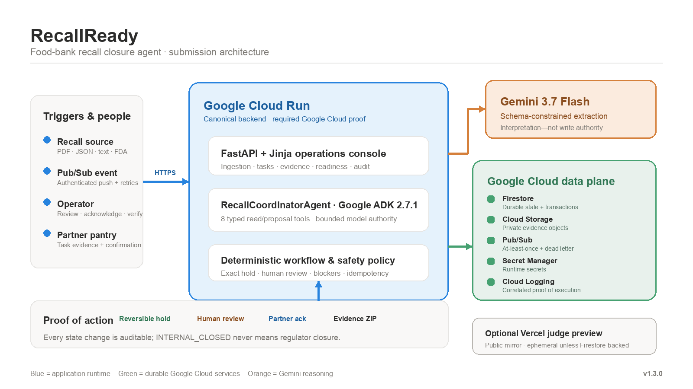
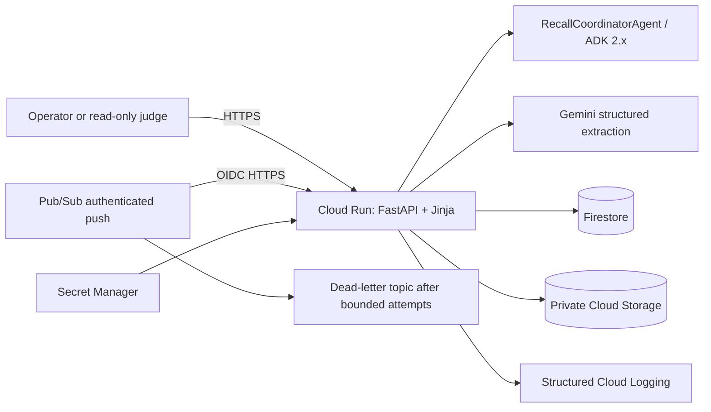
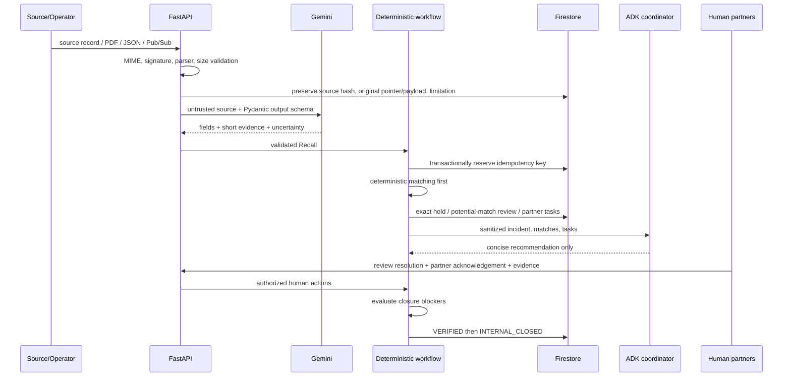
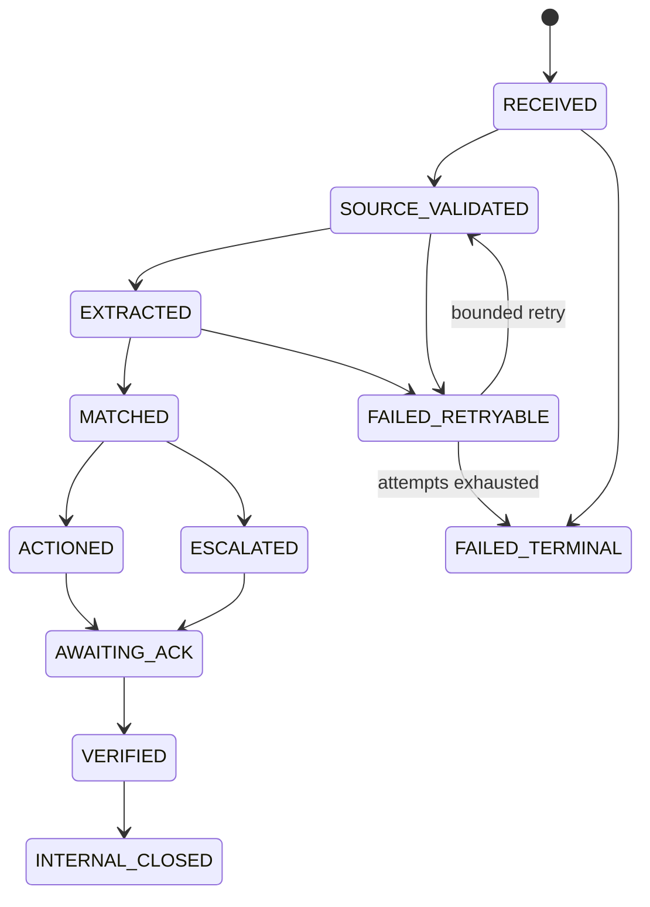

# Architecture

## Context

Food-recall notices can arrive before a food bank has consistent visibility into inventory distributed across partner pantries. The application translates a source record into traceable internal work while keeping interpretation separate from authorization.

## Deployment view

One Cloud Run service is a modular monolith. Local mode replaces Firestore/Cloud Storage with in-memory/local adapters; business logic is unchanged.

## Component responsibilities

| Component | Responsibility | Cannot do |
|---|---|---|
| FastAPI/web | Validate requests, authenticate mutations, render operations UI | Bypass domain policy |
| Gemini service | Extract strict recall fields; observe package evidence | Authorize disposition or exactness |
| ADK coordinator | Call eight sanitized read/proposal tools; summarize open work | Write arbitrary state |
| Workflow engine | Idempotency, legal state transitions, holds, retries, tasks | Change official recall status |
| Verification service | Calculate closure blockers | Infer missing evidence |
| Repository | Persist typed operational records | Treat model memory as durable state |
| Media store | Preserve original uploads privately | Make objects public |

## Event flow

## Business state machine

Every application workflow transition calls `AuditService.transition`; both accepted and rejected transitions create an audit event. Direct unit tests of the pure state-machine function do not represent an application mutation.

## Matching policy

1. Normalize UPC digits and lot separators without changing stored originals.
2. Exact normalized UPC **and** lot yields `EXACT_MATCH` and a reversible `QUARANTINED` hold.
3. One matching identifier, missing evidence, text overlap, or package observation yields a potential match and human review.
4. No qualifying overlap leaves the item unchanged.
5. A human can confirm a potential match and create a hold; no path authorizes disposal or declares safety.

## Idempotency and atomicity

`SHA-256(provider | recall_number | source_hash)` is the incident key. `FirestoreRepository.create_if_absent` uses a transaction. Match IDs are stable by incident+inventory item; partner-task IDs are stable by incident+agency. A redelivered completed event returns the prior incident and records `DUPLICATE_EVENT` without duplicate holds/tasks.

A `FAILED_RETRYABLE` incident can resume only while its bounded attempt count remains. Repeated phases overwrite the same stable child IDs. Permanent poison payloads are recorded as `FAILED_TERMINAL` and acknowledged with an HTTP success so they do not retry forever.

## Trust boundaries

- Recall text, PDFs, images, filenames, source URLs, and API responses are data—not instructions.
- Raw source payloads never become ADK instructions; tools return sanitized fields.
- All model output is Pydantic validated.
- Browser state mutations require administrator session plus CSRF.
- Public/read-only service access is separated from Pub/Sub OIDC and app-authenticated writes.
- Source URLs are stored as provenance; only the fixed `api.fda.gov` endpoint is fetched, preventing arbitrary SSRF.

## Firestore collections

| Collection | Key strategy | Contents |
|---|---|---|
| `recall_sources` | generated source ID | provider, URL, hash, original payload/pointer, limitations |
| `recalls` | generated/stable recall ID | normalized extraction |
| `inventory` | inventory ID | original identifiers and current internal status |
| `incidents` | stable idempotency ID | state, attempts, counts, error category |
| `matches` | incident+item stable hash | category, evidence, human resolution |
| `tasks` | incident+agency stable hash | required action, acknowledgement, private evidence URI |
| `audit_events` | generated event ID | immutable-style transition/action evidence |
| `agencies` | agency ID | fictional demo or organization agency metadata |

## Retry behavior

- Gemini calls use 1–5 bounded attempts with exponential delay for timeout, connectivity, quota/server responses, and schema failures.
- Invalid file types and malformed source content fail without unbounded retry.
- Pub/Sub transient failures return a non-2xx response after durable checkpointing.
- Permanent invalid messages record a terminal incident and return success to stop poison-message delivery.
- Cloud Run and Pub/Sub acknowledgement deadlines are both set to 300 seconds; the seeded demonstration completes far below 60 seconds.

## Local and production modes

`/healthz` and the system-status panel disclose `LIVE_GEMINI`, `MOCK_GEMINI`, or `REPLAY`; actual configured model; `FIRESTORE`/`IN_MEMORY`; `CLOUD_STORAGE`/`LOCAL_MEDIA`; Pub/Sub status; and revision.

## Evidence-pack trust model

An authenticated administrator can export a portable ZIP containing normalized incident, recall, decision, task, and audit records. Raw source payloads and uploaded task media stay in private storage. Every included file has a SHA-256 digest; ordered audit events form a hash chain whose root is repeated in the manifest. A pack is explicitly `PROVISIONAL_OPEN_INCIDENT` or `FINAL_INTERNAL_CLOSURE` and never represents regulator closure.

## Readiness control plane

`/api/readiness` computes local and cloud readiness from redacted booleans and safe identifiers. It never serializes API keys or secret contents. The UI makes mode substitution, missing cloud services, non-free storage regions, billing-account caveats, scale-to-zero, and the max-instance guard visible before a deployment claim.

## Optional Vercel judge preview

Vercel can load `app.main:app` as one Python Function. The `demo` profile requires HTTPS and non-default secrets, caps uploads below the platform's 4.5 MB payload limit, and writes local media only to `/tmp`. Without Firestore this preview is intentionally labeled ephemeral. It is not a substitute for the canonical Cloud Run + Firestore + Pub/Sub proof required in the demonstration video.
